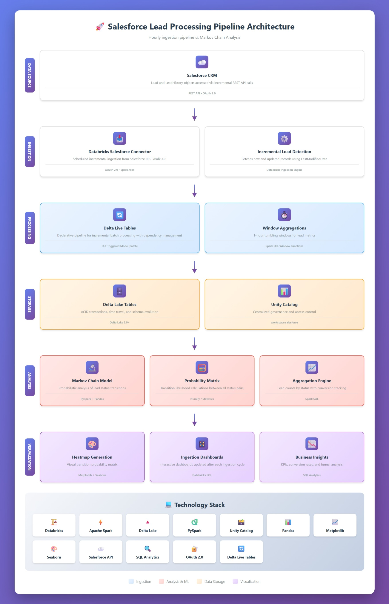
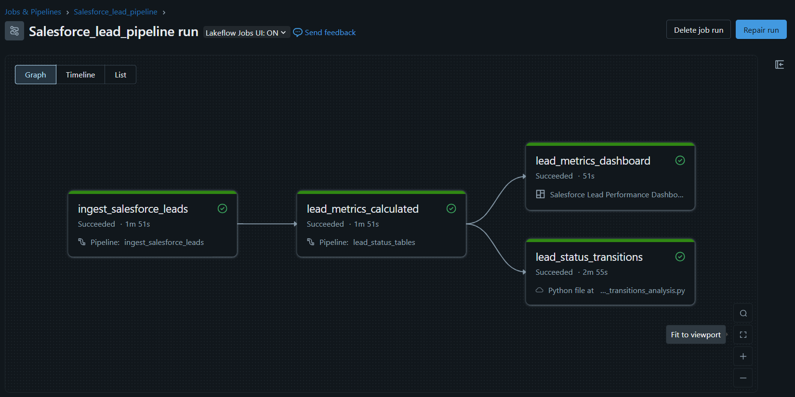
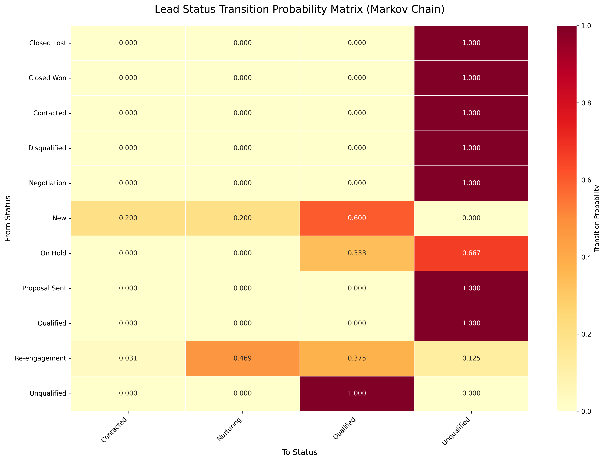
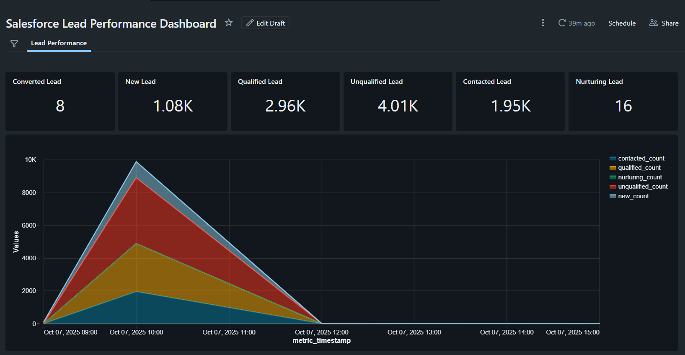

# Salesforce Lead Processing with Databricks

## 📋 Overview

This project implements an **hourly ingestion pipeline** for processing and analyzing Salesforce leads using **Databricks Delta Live Tables (DLT)**. The solution enables **automated lead tracking**, **status transition analysis** with **Markov Chain modeling**, and **actionable insights** via interactive dashboard. The pipeline leverages **Apache Spark**, **Delta Lake**, and **Git-based CI/CD** for reliability and reproducibility.

---

## 🎯 Project Objectives

* Implement **hourly incremental ingestion** from Salesforce using Delta Live Tables
* Achieved **80%** end-to-end pipeline reliability across **15** production runs with an average **4-minute** execution time, running as a fully autonomous cloud-native system with DLT checkpointing, and self-recovery mechanisms.
* Track and analyze **lead status transitions** with probability modeling
* Generate **hourly KPIs** and performance metrics for sales teams
* Provide **predictive insights** using **Markov Chain analysis**
* Create an **interactive dashboard** for ongoing lead performance monitoring

---

## 🏗️ Architecture



---

## 📊 Pipeline Workflow



### Data Flow

1. **Hourly Ingestion** → Load and update lead data from Salesforce using Delta Live Tables
2. **Lead Metrics Aggregation** → Summarize lead counts by status in 1-hour windows
3. **Status Transition Tracking** → Capture all lead status changes from the LeadHistory Table
4. **Markov Chain Analysis** → Compute transition probabilities between lead statuses
5. **Visualization** → Generate heatmaps and dashboards for business insights

---

### 🛠️ Technologies Used

* **Databricks Delta Live Tables (DLT)** — Managed, declarative data ingestion and transformation
* **Databricks Ingestion API (Salesforce connector)** — Automated extraction of `Lead` and `LeadHistory` via REST API
* **Apache Spark** — Distributed data processing and transformation
* **Delta Lake** — Reliable, ACID-compliant data storage for ingested data
* **PySpark** — Transformation logic and Markov Chain transition analysis
* **Pandas & Matplotlib** — Probability matrix construction and visualization
* **Seaborn** — Transition heatmap visualization
* **Git & CI/CD** — Version control and automated deployment pipelines

---

## 📁 Project Structure

```
lead_salesforce/
├── sql/
│   ├── lead_salesforce.sql              # Hourly ingestion & lead metrics
│   └── lead_status_transitions.sql      # Lead status transition tracking
├── python/
│   └── lead_status_transitions_analysis.py  # Markov Chain analysis & visualization
├── images/
│   ├── pipeline_diagram.png
│   ├── dashboard_screenshot.png
│   ├── lead_status_transition_heatmap.png
│   └── salesforce_architecture_diagram.jpeg
└── README.md
```

---

## 📈 Pipeline Components

### 1. Lead Metrics Table (`lead_salesforce.sql`)

Hourly aggregation of leads by status:

```sql
CREATE OR REFRESH STREAMING TABLE lead_metrics AS
SELECT
  window.start AS metric_timestamp,
  SUM(CASE WHEN Status IN ('New', 'New Lead') THEN 1 ELSE 0 END) AS new_count,
  SUM(CASE WHEN Status IN ('Contacted', 'Re-engagement') THEN 1 ELSE 0 END) AS contacted_count,
  SUM(CASE WHEN Status = 'Nurturing' THEN 1 ELSE 0 END) AS nurturing_count,
  SUM(CASE WHEN Status IN ('Qualified', 'Proposal Sent', 'Negotiation') THEN 1 ELSE 0 END) AS qualified_count,
  SUM(CASE WHEN Status IN ('On Hold', 'Closed Won', 'Closed Lost', 'Unqualified', 'Disqualified') THEN 1 ELSE 0 END) AS unqualified_count,
  SUM(CASE WHEN IsConverted = TRUE THEN 1 ELSE 0 END) AS is_converted_count
FROM STREAM(lead)
GROUP BY window(lead.LastModifiedDate, '1 hour')
```

**Tracked Metrics:**

* New Leads
* Contacted Leads
* Nurturing Leads
* Qualified Leads
* Unqualified/Closed Leads
* Converted Leads

---

### 2. Lead Status Transitions Table (`lead_status_transitions.sql`)

Captures lead status changes from Salesforce LeadHistory:

```sql
CREATE OR REFRESH STREAMING TABLE lead_status_transitions AS
SELECT 
  Field, 
  OldValue, 
  NewValue, 
  COUNT(*) AS total,
  COLLECT_LIST(LeadId) AS lead_ids,
  current_timestamp() AS created_at
FROM STREAM(workspace.salesforce.leadhistory)
GROUP BY Field, OldValue, NewValue
ORDER BY total DESC
```

---

### 3. Markov Chain Analysis (`lead_status_transitions_analysis.py`)

Modeling of status transitions as a probabilistic system.

**Key Features:**

* Computes conditional transition probabilities
* Creates transition probability matrix
* Generates heatmap visualization
* Writes results back to Databricks table

**Output:**

* `workspace.salesforce.lead_status_transition_probs`
* `lead_status_transition_heatmap.png`



### ✅ **1. Re-engagement Success Rate** 
**Current:** 37.5% of re-engaged leads become *Qualified* 
**Insight:** The re-engagement campaigns are effective — they revive dormant leads. 
> **Goal:** Increase *Re-engagement → Qualified* rate from **37.5% → 50%** by improving email personalization and timing. 

---

### ⚠️ **2. Contacted Drop-off Rate** 
**Current:** 100% of *Contacted* leads become *Unqualified* 
**Insight:** Major breakdown after initial outreach — leads are not converting after contact. 
> **Goal:** Reduce *Contacted → Unqualified* rate from **100% → <50%** by refining outreach scripts and follow-up cadence. 

---

### 🔴 **3. Qualified Reversal Rate** 
**Current:** 100% of *Qualified* leads later marked *Unqualified* 
**Insight:** Qualification criteria are too loose — leads pass the filter but later get rejected. 
> **Goal:** Lower *Qualified → Unqualified* rate from **100% → <20%** by tightening qualification rules or introducing a scoring threshold.

---

## 📊 Dashboard



### Key Metrics

* Total leads by status (hourly)
* Transition probabilities
* Conversion funnel breakdown

---

### 📋 **Executive Summary**

The Salesforce Lead Performance Dashboard shows strong lead acquisition but major conversion bottlenecks. Over 4K leads are unqualified, and only 8 of 2.96K qualified leads converted. The re-engagement stage performs well (37.5% → Qualified), but contacted and qualified leads show high reversal rates, indicating gaps in qualification and follow-up strategies. Strengthening lead scoring and nurturing efforts can increase conversion efficiency.

---

## 🔄 Pipeline Execution

### Delta Live Tables

* **Mode:** Hourly ingestion
* **Update Frequency:** Every 1 hour
* **Checkpointing:** Managed by Delta Lake

### Markov Chain Analysis

* **Frequency:** Hourly
* **Execution Time:** 1–2 minutes
* **Output:** Spark table + PNG visualization

---

## 📊 Data Schema 

### Streaming Tables 

**lead_metrics:** 

| Column | Type | Description | 
|--------|------|-------------| 
| metric_timestamp | timestamp | Start of 1-hour window | 
| new_count | long | Count of new leads | 
| contacted_count | long | Count of contacted leads | 
| nurturing_count | long | Count of nurturing leads | 
| qualified_count | long | Count of qualified leads | 
| unqualified_count | long | Count of unqualified/closed leads | 
| is_converted_count | long | Count of converted leads | 

**lead_status_transitions:** 

| Column | Type | Description | 
|--------|------|-------------| 
| Field | string | Changed field name | 
| OldValue | string | Previous status value | 
| NewValue | string | New status value | 
| total | long | Number of transitions | 
| lead_ids | array<string> | List of affected lead IDs | 
| created_at | timestamp | Analysis timestamp | 

**lead_status_transition_probs:** 

| Column | Type | Description | 
|--------|------|-------------| 
| from_status | string | Source status | 
| to_status | string | Destination status | 
| count | long | Number of transitions | 
| probability | double | Transition probability (0-1) |

---

## 🔧 Continuous Integration / Delivery (CI/CD)

* **Git** for version control of SQL, Python, and configs
* **Databricks Repos** for syncing notebooks and SQL scripts
* **CI/CD Pipelines** for automated deployment of DLT pipelines

---

## 🙏 Acknowledgments

* Databricks Delta Live Tables documentation
* Salesforce API documentation
* Markov Chain modeling resources
* Delta Lake & Apache Spark communities

---
